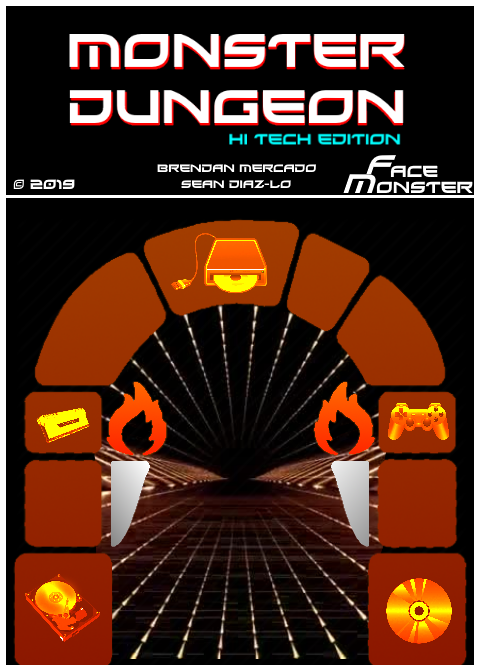
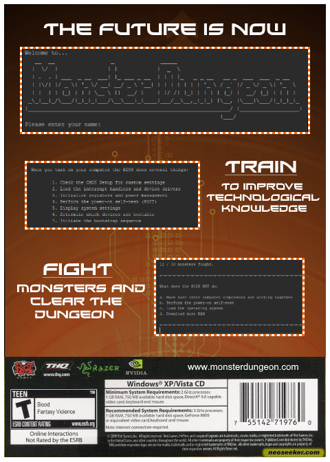

# Monster Dungeon

| Front cover  | Back cover |
| :-------------: | :-------------: |
|  |   |

Monster Dungeon is a text-based game created in Java that is designed to teach players about computer hardware based on the information found here: [HowStuffWorks](https://computer.howstuffworks.com/computer-hardware-channel.htm)[^1]. This game was created as the ISU for my Grade 11 ICS3U class.

[^1]: Information used in the game was taken during June 2019 and may not be representative of the website's current contents.

Link to the game's [manual](images/manual.pdf). Box art was made in [paint.net](https://www.getpaint.net/) and all original images belong to their respective creators.